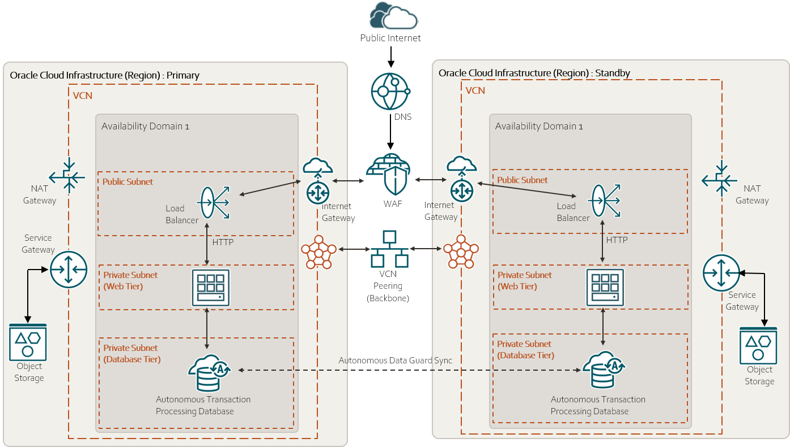

# Web Application HA multi Regions

## Overview 

The current folder is a terraform project that deploy a web application in HA in Oracle Cloud.
More in details, HA is achieved by creating the infrastructure in multi regions.
As a consequence, this infrastructure can be exploited in a Disaster Recovery strategy.

## Architecture

