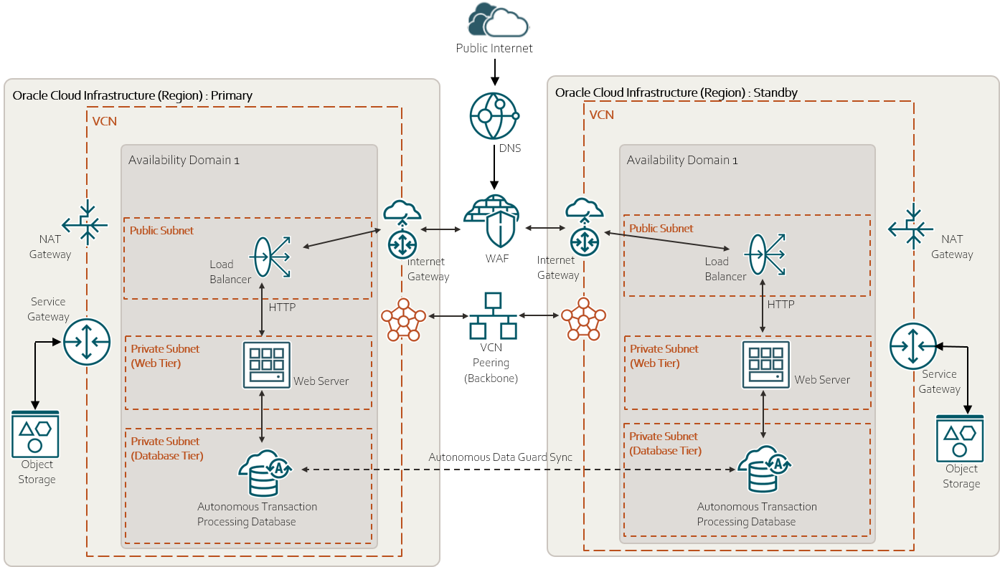

# Web Application HA multi AD

## Overview 

The current folder is a terraform project that deploy a web application in HA in Oracle Cloud.
More in details, HA is achieved by creating the infrastructure in multi availability domains.

## Architecture

