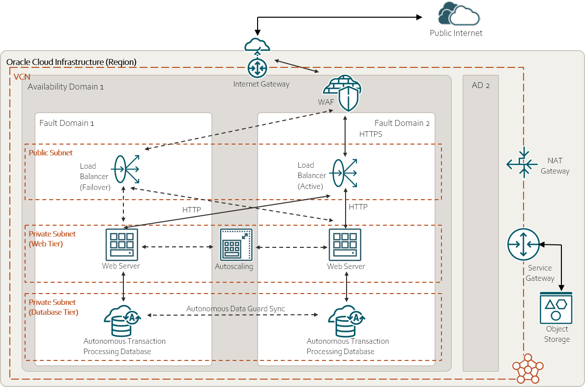

# Web Application HA single AD

## Overview 

The current folder is a terraform project that deploy a web application in HA in Oracle Cloud.
More in details, HA is achieved by creating the infrastructure in multi fault domains within a single availability domain.

## Architecture

